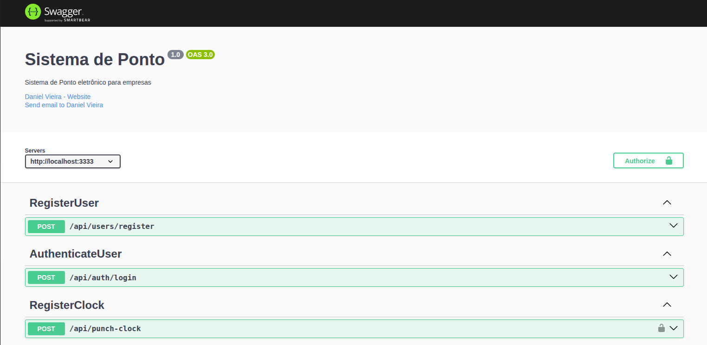
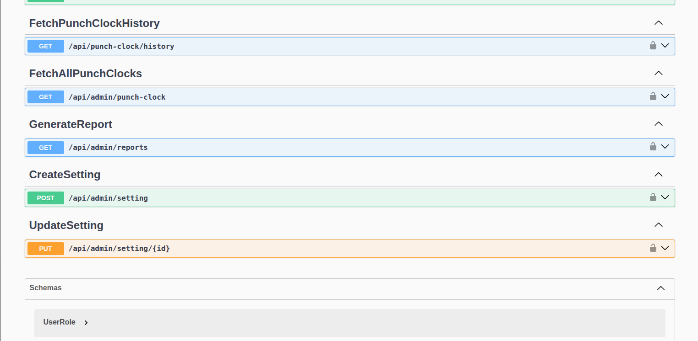

# Sistema de Ponto Eletrônico (Desafio Racoelho)

## Descrição

Este projeto é uma implementação de um Sistema de Ponto Eletrônico, desenvolvido como parte de um desafio proposto. O sistema permite que funcionários registrem seus pontos de entrada e saída, e que administradores gerenciem esses registros, visualizem relatórios e acompanhem as horas trabalhadas.

O objetivo principal é fornecer uma solução robusta e intuitiva para o controle de jornada de trabalho, atendendo às necessidades de diferentes perfis de usuários dentro de uma organização.

## Funcionalidades Principais

### Para Funcionários:
* **Registro de Ponto:** Marcar entrada e saída de forma simples e rápida.
* **Visualização de Histórico:** Acessar o histórico dos seus próprios registros de ponto.

### Para Administradores:
* **Gerenciamento de Usuários:** (Inferido, comum em sistemas com roles) Cadastrar, editar e remover usuários (funcionários e outros administradores).
* **Visualização de Pontos de Todos os Funcionários:** Acompanhar os registros de ponto de todos os usuários do sistema.
* **Relatórios de Horas Trabalhadas:** Gerar relatórios com o total de horas trabalhadas por funcionário em um determinado período.
* **Espelho de Ponto:** (Inferido, funcionalidade comum) Visualizar um resumo diário dos registros de um funcionário, incluindo check-in, check-out e horas trabalhadas.
* **Geração de Relatório em JSON:** Exportar um relatório consolidado das horas trabalhadas dos funcionários.

## Tecnologias Utilizadas

* **Backend:** Node.js com NestJS (framework TypeScript)
* **Banco de Dados:** PostgreSQL (ou SQLite para desenvolvimento/testes, como visto nas interações)
* **ORM:** Prisma
* **Autenticação:** JWT (JSON Web Tokens)
* **Validação de Dados:** `class-validator`, `class-transformer` e `zod`,
* **Testes:** Vitest, Supertest (para testes E2E)
* **Manipulação de Datas/Horas:** Day.js
* **Utilitários:** BcryptJS (para hashing de senhas)

## 🚀 Documentação da API

A documentação completa e interativa dos endpoints está disponível através do Swagger UI. Para acessá-la, inicie a aplicação e navegue para o seguinte endereço:

➡️ **[Swagger](http://localhost:3000/api)**

Lá você pode visualizar todas as rotas, seus parâmetros, DTOs (schemas) e até mesmo testar os endpoints diretamente pelo navegador.





A seguir, a descrição de todos os endpoints disponíveis na aplicação.

### Autenticação e Usuários

| Método HTTP | Endpoint                  | Descrição                                         | Autenticação |
| :---------- | :------------------------ | :------------------------------------------------ | :----------- |
| `POST`      | `/api/users/register`     | Cria um novo usuário no sistema.                  | Não          |
| `POST`      | `/api/auth/login`         | Autentica um usuário e retorna um token JWT.      | Não          |

### Funcionários

| Método HTTP | Endpoint                  | Descrição                                                      | Autenticação |
| :---------- | :------------------------ | :------------------------------------------------------------- | :----------- |
| `POST`      | `/api/punch-clock`        | Registra um horário de entrada ou saída para o usuário logado. | **Sim** |
| `GET`       | `/api/punch-clock/history`| Retorna o histórico de pontos do usuário logado.               | **Sim** |

### Administradores

| Método HTTP | Endpoint                                                              | Descrição                                                                 | Autenticação   |
| :---------- | :-------------------------------------------------------------------- | :------------------------------------------------------------------------ | :------------- |
| `GET`       | `/api/admin/punch-clock`                                              | Retorna todos os registros de ponto do sistema.                           | **Sim (Admin)**|
| `GET`       | `/api/admin/punch-clock?employeeId={id}&startDate={data}&endDate={data}`| Filtra os registros por funcionário e/ou período.                         | **Sim (Admin)**|
| `GET`       | `/api/admin/reports?startDate={data}&endDate={data}`                  | Gera um relatório consolidado de horas por um período específico.         | **Sim (Admin)**|


## Pré-requisitos

* Node.js (versão LTS recomendada, ex: v18.x ou v20.x)
* Yarn ou NPM (gerenciador de pacotes)
* Docker e Docker Compose (opcional pois, estamos utilizando SQLite no projeto, mas recomendado para gerenciar o banco de dados)
* Um cliente de banco de dados PostgreSQL (como DBeaver, pgAdmin) ou SQLite (como DB Browser for SQLite)

---
### AVISO !

Caso você deseje trocar o banco de dados para **PostgreSQL**, deverá fazer alterações nas queries raw do projeto e no arquivo `(raíz)/test/setup-e2e.ts` para modificar o banco nos testes E2E.

---

## Instalação e Configuração

1.  **Clone o repositório:**
    ```bash
    git clone https://github.com/DanielVieiraFernandes/sistema-de-ponto.git
    cd sistema-de-ponto
    ```

2.  **Instale as dependências:**
    ```bash
    yarn install
    # ou
    npm install
    ```

3.  **Configuração do Ambiente:**
    * Copie o arquivo de exemplo de variáveis de ambiente:
        ```bash
        
        cp .env.example .env
        ```
    * Edite o arquivo `.env` com as suas configurações de banco de dados (URL do banco, usuário, senha, etc.) e a chave secreta para JWT.
        Exemplo para PostgreSQL:
        ```env
       # Port of Application 
       PORT= 
       DATABASE_URL= sqlite path or postgreSQL url 
       # JWT Keys
       JWT_PRIVATE_KEY=rs256 in base 64
       JWT_PUBLIC_KEY=rs256 in base 64
        ```

4.  **Executar as Migrations do Banco de Dados (Prisma):**
    ```bash
    npx prisma migrate dev
    ```
    Isso criará as tabelas no seu banco de dados com base no schema do Prisma.


## Executando a Aplicação

```bash
yarn start:dev
# ou
npm run start:dev

A aplicação estará disponível, por padrão, em `http://localhost:3000` (ou a porta configurada no seu projeto).

## Endpoints da API (Exemplos Principais)

* `POST /auth/login` - Autenticação de usuários.
* `POST /punch-clock/check-in` - Registrar entrada (requer autenticação de funcionário).
* `POST /punch-clock/check-out` - Registrar saída (requer autenticação de funcionário).
* `GET /punch-clock/history` - Listar histórico de pontos do funcionário logado (com paginação).
* `GET /admin/punch-clock` - Listar todos os registros de ponto (requer autenticação de ADMIN, com paginação e filtro por `employeeId`).
* `GET /admin/punch-clock/report` - Gerar relatório consolidado em JSON (requer autenticação de ADMIN, com filtro opcional por `employeeId`).

## Executando os Testes

Para rodar os testes unitários e de integração (E2E):

```bash
# Rodar todos os testes
yarn test
# ou
npm test

# Rodar testes E2E
yarn test:e2e
# ou
npm run test:e2e

# Rodar testes com coverage
yarn test:cov
# ou
npm run test:cov

## Licença
```

Este projeto pode ser distribuído sob a licença MIT.

---

Desenvolvido como parte do Desafio de Sistema de Ponto da [Racoelho](https://racoelho.com.br/).